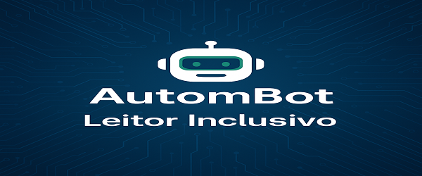
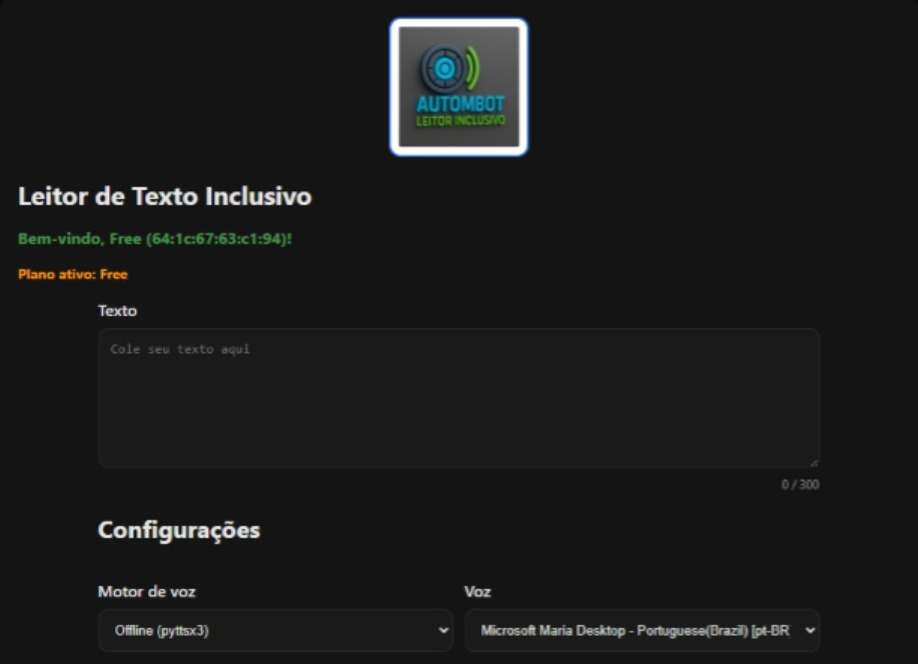

# 🤖 AutomBot - Leitor Inclusivo  

O **Leitor Inclusivo** é um programa desenvolvido pela **AutomBot** para facilitar a acessibilidade através de leitura de textos em voz alta.  
Ele possui suporte a diferentes vozes, ajustes de velocidade/volume e planos Free e Plus.  

---

## 📸 Capturas de Tela
### Tela de Carregamento  

### Tela Principal  

### Ativação do Plano Plus  

---

## 🚀 Funcionalidades
- 🔊 Leitura de textos em voz alta.  
- ⚡ Suporte a múltiplos motores de voz (offline e online).  
- 🎚️ Ajuste de velocidade e volume.  
- 🆓 **Plano Free**: limite de 300 caracteres.  
- 💎 **Plano Plus**: texto ilimitado e suporte completo.  

---

## 📥 Download
➡️ [Clique aqui para baixar o instalador (.exe)](https://drive.google.com/file/d/1Q1DGJhhjRITUQw4vksZucFKvFlW7KsAk/view?usp=sharing)  

*(O link acima será válido após você criar uma release no GitHub e adicionar o instalador.)*

---

## ⚙️ Instalação
1. Baixe o instalador pelo link acima.  
2. Execute o arquivo `LeitorInclusivo-Setup.exe`.  
3. Siga as instruções na tela.  
4. Abra o programa e comece a usar.  

---

## 📄 Licença
Este projeto é distribuído sob licença proprietária da **AutomBot**.  
Para planos corporativos, entre em contato: **contato@autombot.com.br**  

---
